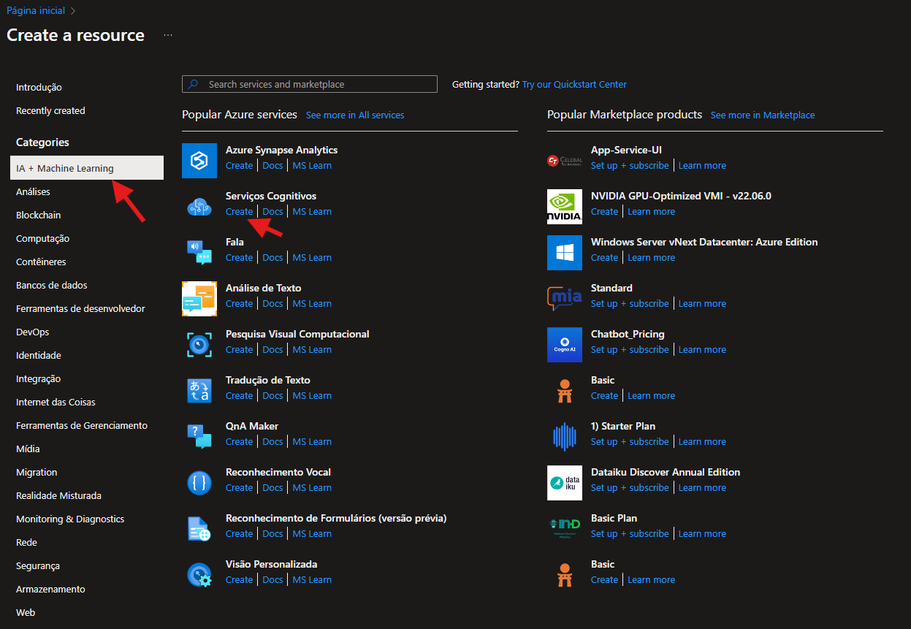
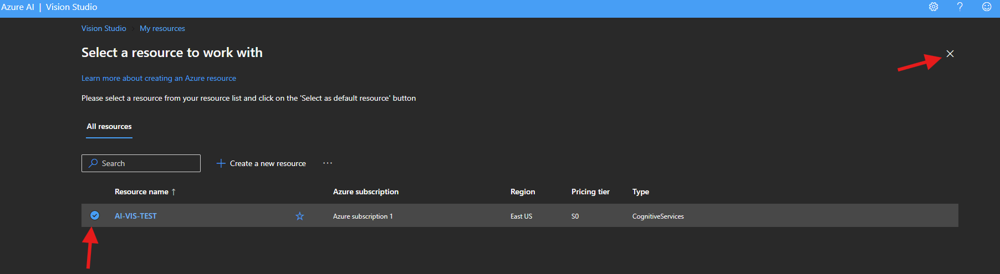
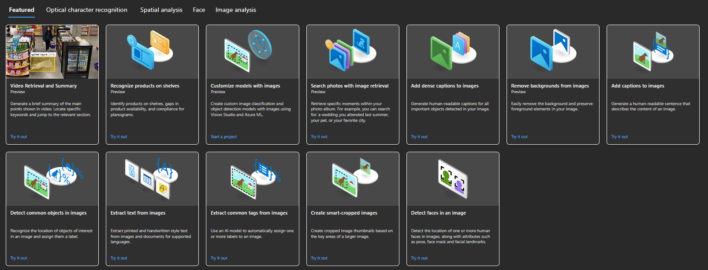
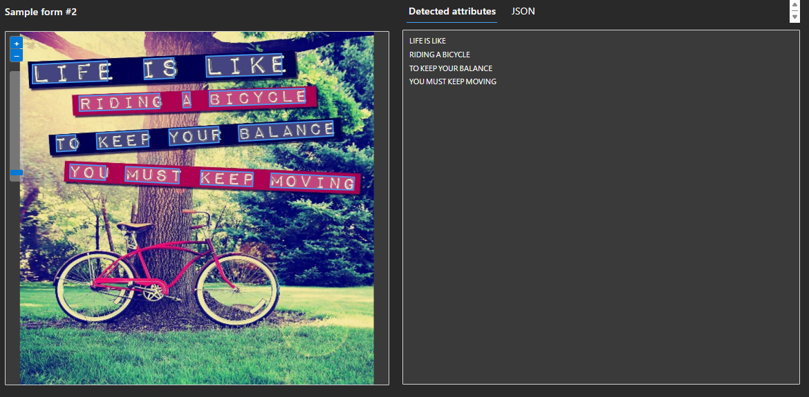
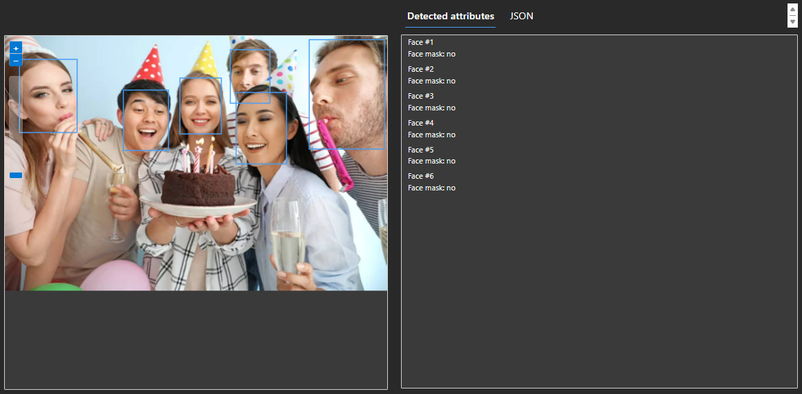
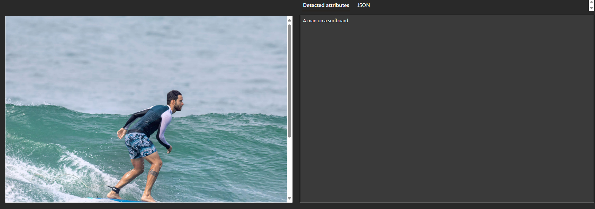

# Azure Vision Studio
Análise de Imagem com o AI Vision Service da Microsoft.

O Azure AI Vision Studio é uma plataforma robusta da Microsoft Azure que facilita a criação, treinamento e implementação de modelos de visão computacional. Ela proporciona um ambiente unificado com diversas ferramentas e funcionalidades que simplificam o processo de desenvolvimento de soluções de IA focadas em visão computacional.

## Instruções📕

### Crie um recurso no Portal Azure

1 - Acesse o [Portal Azure](https://portal.azure.com/).

2 - Faça login com sua conta Azure/Microsoft.

3 - Procure a opção "Criar um Recurso" e selecione "AI + Machine Learning"

4 - Selecione a opção Serviços Cognitivos e criar

Imagem

ㅤ

5 - Preencha os campos e depois clique em Examinar + Criar, confira as informações e crie.

### Vision Studio

1 - Acesse o [Portal do Vision Studio](https://portal.vision.cognitive.azure.com/my-resources).

2 - Caso seja necessário logue com sua conta novamente.

3 - Selecione o recurso que você criou em seguida aperte o X.

Imagem

ㅤ

4 - Selecione o serviços disponibilizados:

Imagem

ㅤ

* Reconhecimento Óptico de Caracteres (OCR)
    
    Use a API Read para extrair texto impresso e manuscrito em idiomas suportados de imagens, PDFs e arquivos TIFF. O recurso de reconhecimento óptico de caracteres (OCR) oferece suporte a imagens e documentos com idiomas mistos e não exige a especificação do idioma.

* Análise Espacial

    A análise espacial no Azure Vision Studio é uma das funcionalidades oferecidas que permite analisar vídeos em tempo real para detectar e rastrear movimentos e comportamentos de pessoas em um campo de visão de uma câmera. Alguns pontos são:
    Detecção de Movimento, Contagem de Pessoas, Monitoramento de Distanciamento Social, etc.

* Análise Facial

    Detecta a localização de um ou mais rostos humanos em imagens, juntamente com atributos como pose, máscara facial e pontos de referência faciais.

* Análise de Imagens
    A Análise de Imagem no Azure Vision Studio é uma funcionalidade que permite:

        Reconhecimento de Objetos: Identifica a localização de objetos de interesse em uma imagem e atribui rótulos a eles.

        Geração de Legendas: Cria frases legíveis por humanos que descrevem o conteúdo de uma imagem.
    
        Extração de Tags: Utiliza um modelo de IA para atribuir automaticamente uma ou mais etiquetas a uma imagem.
    
       Detecção de Conteúdo Sensível: Detecta conteúdo sensível em imagens para moderar seu uso em aplicações.
    
    Essas ferramentas são projetadas para ajudar a organizar, moderar e extrair informações valiosas de conjuntos de imagens. Além disso, o Azure AI enfatiza o uso responsável da IA, seguindo princípios de justiça, confiabilidade, segurança, privacidade e inclusão.

5 - Sempre que testar marque a caixa que está de acordo com o uso do recurso que você criou e lembre-se que pode causar custos, então após os teste exclua o recurso criado, caso não consiga usar certifique-se que selecionou o recurso criado.

## Exemplos e Proximos Passos 🔍

### Reconhecimento Óptico de Caracteres (OCR)
Abaixo está a representação do funcionamento do OCR, um texto na imagem foi extraído em seguida colocado no output.

### Análise Espacial
A funcionalidade de Análise Espacial do Azure AI Vision Studio é projetada para analisar a disposição e interação de elementos em imagens e vídeos. Ela fornece ferramentas para:

- Recuperação e resumo de um vídeo. 

- Contagem de pessoas em uma área. 

- Detectar quando uma ou mais pessoas ultrapassam um limite. 

- Detectar quando uma ou mais pessoas entram ou saem de uma zona delimitada. 

- Monitorar o distanciamento social.

### Análise Facial
Abaixo está a representação do funcionamento da análise facial, ao lado é o output fornecido informando quantos rostos tem na imagem e se tem alguma "máscara", como óculos, borrões, o que está sendo coberto, etc.

### Análise de Imagens
É usada para:

- Reconhecer produtos em uma prateleira
- Personalize modelos com imagem
- Pesquise fotos com recuperação de imagem
- Adicone legendas densas às imagens
- Remover fundo de imagens
- Adicionar legendas às imagens
- Detecta objetos comuns em imagens
- Extraia tags comuns das imagens
- Detecta conteúdo confidencial em imagens
- Cria imagens cortadas de forma inteligente

Um exemplo de adição de legenda a uma imagem:

### Próximos Passos

Ao final de cada Experimento tem artigos/tutoriais explicando como seria feita a integração de cada um dos elementos/recursos citados a cima.

## Conclusão
O Vision Studio é um conjunto de ferramentas baseadas em interface do usuário que permite explorar, compilar e integrar recursos da Visão de IA do Azure.

O Vision Studio permite que você experimente vários recursos de serviço e obtenha amostras dos dados retornados de maneira rápida e direta. Usando o Vision Studio, é possível começar a experimentar os serviços e saber o que eles oferecem sem precisar escrever nenhum código. Em seguida, use as bibliotecas de cliente disponíveis e as APIs REST para começar a inserir esses serviços em seus aplicativos.